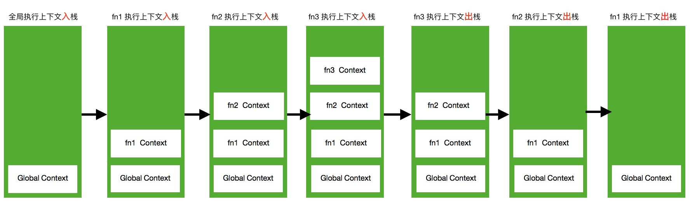

# JS执行上下文和作用域链

#### 执行上下文

**执行上下文**就是当前JavaScript代码被解析和执行时所在在环境的抽象概念，JavaScript中运行的代码都是在执行上下文中运行。

> 执行上下文类型分为：

- 全局执行上下文
- 函数执行上下文
- eval函数执行上下文(不推荐使用)

执行上下文创建过程中，需要做以下几件事：

1. 创建变量对象：首先初始化函数参数arguments，提升函数声明和变量声明。
2. 创建作用域链(Scope Chain)：在执行期上下文的创建阶段，作用域链是在变量对象之后创建的。
3. 确定this的值，即 ResolveThisBinding

#### 作用域

**作用域**负责收集和维护由所有声明的标识符(变量)组成的一系列查询，并实施一套非常严格的规则，确定当前执行的代码对这些标识符的访问权限。—— 摘录自《你不知道的JavaScript》(上卷)

作用域有两种工作模式：词法作用域和动态作用域，JS采用的是**词法作用域**工作模式，词法作用域意味着作用域是由书写代码时变量和函数声明的位置决定的。(`with`和`eval`能够修改词法作用域，但是不推荐使用)

> 作用域分为：

- 全局作用域
- 函数作用域
- 块级作用域

#### JS执行上下文栈(后面简称执行栈)

执行栈，也叫做调用栈，具有 **LIFO** (后进先出) 结构，用于存储在代码执行期间创建的所有执行上下文。

> 规则如下：
> - 首次运行JavaScript代码的时候,会创建一个全局执行的上下文并Push到当前的执行栈中，每当发生函数调用，引擎都会为该函数创建一个新的函数执行上下文并Push当前执行栈的栈顶。
> - 当栈顶的函数运行完成后，其对应的函数执行上下文将会从执行栈中Pop出，上下文的控制权将移动到当前执行栈的下一个执行上下文。

以一段代码具体说明：

```javascript
function fun3() {
    console.log('fun3')
}

function fun2() {
    fun3();
}

function fun1() {
    fun2();
}

fun1();
```

`Global Execution Context` (即全局执行上下文)首先入栈，过程如下：



伪代码：

```javascript
//全局执行上下文首先入栈
ECStack.push(globalContext);

//执行fun1();
ECStack.push(<fun1> functionContext);

//fun1中又调用了fun2;
ECStack.push(<fun2> functionContext);

//fun2中又调用了fun3;
ECStack.push(<fun3> functionContext);

//fun3执行完毕
ECStack.pop();

//fun2执行完毕
ECStack.pop();

//fun1执行完毕
ECStack.pop();

//javascript继续顺序执行下面的代码，但ECStack底部始终有一个 全局上下文（globalContext）;
```

#### 作用域链

作用域链就是从当前作用域开始一层一层向上寻找某个变量，直到找到全局作用域还是没找到，就宣布放弃。这种一层一层的关系，就是作用域链。

如：

```javascript
var a = 10;
function fn1() {
    var b = 20;
    console.log(fn2)
    function fn2() {
        a = 20
    }
    return fn2;
}
fn1()();
```

fn2作用域链 = [fn2作用域, fn1作用域，全局作用域]