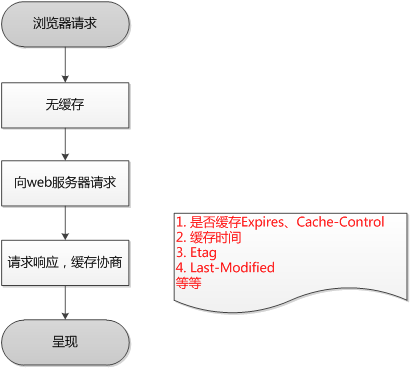
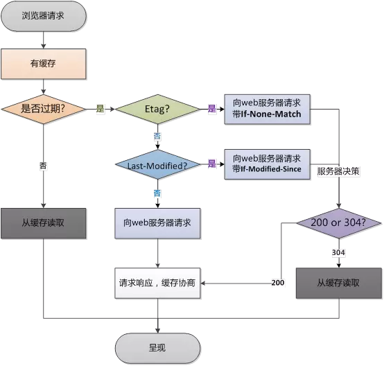
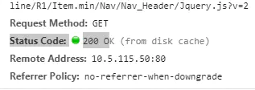
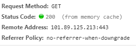
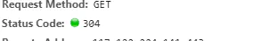

# 计算机网络

### CDN 工作原理

CDN 的基本原理是广泛采用各种缓存服务器，将这些缓存服务器分布到用户访问相对集中的地区或网络中，在用户访问网站时，利用全局负载技术将用户的访问指向距离最近的工作正常的缓存服务器上，由缓存服务器直接响应用户请求。

#### 1. 用户访问 cdn 资源的过程

1. 用户向浏览器输入 www.web.com 这个域名，浏览器第一次发现本地没有 DNS 缓存，则向网站的 DNS 服务器请求；
2. 网站的 DNS 域名解析器设置了 CNAME，指向了 www.web.cdn.com ，请求指向了 CDN 网络中的智能 DNS 负载均衡系统；
3. 智能 DNS 负载均衡系统解析域名，把对用户响应速度最快的 IP 节点（CDN 服务器）返回给用户；
4. 用户向该 IP 节点（CDN 服务器）发出请求；
5. 由于是第一次访问，CDN 服务器会向原 web 站点请求，并缓存内容；
6. 请求结果发给用户。

#### 2. cdn 主要特点

1. **本地 Cache 加速** 提高了企业站点（尤其含有大量图片和静态页面站点）的访问速度，并大大提高以上性质站点的稳定性
2. **镜像服务** 消除了不同运营商之间互联的瓶颈造成的影响，实现了跨运营商的网络加速，保证不同网络中的用户都能得到良好的访问质量。
3. **远程加速** 远程访问用户根据 DNS 负载均衡技术智能自动选择 Cache 服务器，选择最快的 Cache 服务器，加快远程访问的速度
4. **带宽优化** 自动生成服务器的远程 Mirror（镜像）cache 服务器，远程用户访问时从 cache 服务器上读取数据，减少远程访问的带宽、分担网络流量、减轻原站点 WEB 服务器负载等功能。
5. **集群抗攻击** 广泛分布的 CDN 节点加上节点之间的智能冗余机制，可以有效地预防黑客入侵以及降低各种 D.D.o.S 攻击对网站的影响，同时保证较好的服务质量 。

### CDN 的应用场景

#### 1. 网站站点/应用加速

站点或者应用中大量静态资源的加速分发，建议将站点内容进行动静分离，动态文件可以结合云服务器 ECS，静态资源如各类型图片、html、css、js 文件等，建议结合 对象存储 OSS 存储海量静态资源，可以有效加速内容加载速度，轻松搞定网站图片、短视频等内容分发

#### 2. 视音频点播/大文件下载分发加速

支持各类文件的下载、分发，支持在线点播加速业务，如 mp4、flv 视频文件或者平均单个文件大小在 20M 以上，主要的业务场景是视音频点播、大文件下载（如安装包下载）等，建议搭配对象存储 OSS 使用，可提升回源速度，节约近 2/3 回源带宽成本。

#### 3. 视频直播加速（内测中）

视频流媒体直播服务，支持媒资存储、切片转码、访问鉴权、内容分发加速一体化解决方案。结合弹性伸缩服务，及时调整服务器带宽，应对突发访问流量；结合媒体转码服务，享受高速稳定的并行转码，且任务规模无缝扩展。目前 CDN 直播加速已服务内部用户测试并优化，即将上线

#### 4. 移动应用加速

移动 APP 更新文件（apk 文件）分发，移动 APP 内图片、页面、短视频、UGC 等内容的优化加速分发。提供 httpDNS 服务，避免 DNS 劫持并获得实时精确的 DNS 解析结果，有效缩短用户访问时间，提升用户体验。

### HTTP 缓存

#### 1. 什么是缓存

> 浏览器缓存(Browser Caching)是浏览器对之前请求过的文件进行缓存，以便下一次访问时重复使用，节省带宽，提高访问速度，降低服务器压力。

http 缓存机制主要在 http 响应头中设定，响应头中相关字段为 Expires、Cache-Control、Last-Modified、Etag

#### 2. 浏览器如何判断是否使用缓存

- 第一次请求

  

- 第二次请求相同页面

  

#### 3. 缓存的类别

> 浏览器缓存分为**强缓存**和**协商缓存**。

##### 强缓存类型：

浏览器不会像服务器发送任何请求，直接从本地缓存中读取文件并返回 `Status Code: 200 OK`

**优先访问 memory cache,其次是 disk cache，最后是请求网络资源**

`200 form memory cache` : 不访问服务器，一般已经加载过该资源且缓存在了内存当中，直接从内存中读取缓存。浏览器关闭后，数据将不存在（资源被释放掉了），再次打开相同的页面时，不会出现 from memory cache。



`200 from disk cache`： 不访问服务器，已经在之前的某个时间加载过该资源，直接从硬盘中读取缓存，关闭浏览器后，数据依然存在，此资源不会随着该页面的关闭而释放掉下次打开仍然会是 from disk cache。



##### 协商缓存：

向服务器发送请求，服务器会根据这个请求的 request header 的一些参数来判断是否命中协商缓存，如果命中，则返回 304 状态码并带上新的 response header 通知浏览器从缓存中读取资源。



#### 4. 强缓存和协商缓存的`header`参数

##### ① 强缓存的 header：

> `Cache-Control`是 HTTP/1.1 的头字段，`Expires`是 HTTP/1.0 的头字段,如果两者同时存在，`Cache-Control`会覆盖`Expires`，建议两个都写。

`Expires`：在 HTTP/1.0 中被定义过期时间，如果设置了时间，则浏览器会在设置的时间内直接读取缓存，不再请求。

`Cache-Control`：在 HTTP/1.1 中被定义的，它可以用于取代之前的缓存策略，现在所有的浏览器都支持，它已经成为一种通用的标准。

Cache-Control 参数如下：

|   参数   |                                                                                                                                                                   作用                                                                                                                                                                   |
| :------: | :--------------------------------------------------------------------------------------------------------------------------------------------------------------------------------------------------------------------------------------------------------------------------------------------------------------------------------------: |
| max-age  |                                                                                                                                       用来设置资源（representations）可以被缓存多长时间，单位为秒                                                                                                                                        |
| s-maxage |                                                                                                                                           和 max-age 是一样的，不过它只针对代理服务器缓存而言                                                                                                                                            |
|  public  |                                                                                                                                                        指示响应可被任何缓存区缓存                                                                                                                                                        |
| private  |                                                                                                                                                 只能针对个人用户，而不能被代理服务器缓存                                                                                                                                                 |
| no-cache | 强制客户端直接向服务器发送请求,也就是说每次请求都必须向服务器发送。服务器接收到请求，然后判断资源是否变更，是则返回新内容，否则返回 304，未变更。这个很容易让人产生误解，使人误以为是响应不被缓存。**实际上 Cache-Control: no-cache 是会被缓存的，只不过每次在向客户端（浏览器）提供响应数据时，缓存都要向服务器评估缓存响应的有效性。** |
| no-store |                                                                                                                                                禁止一切缓存（这个才是响应不被缓存的意思）                                                                                                                                                |

##### ② 协商缓存的 header

> `Last-Modified/If-Modified-Since`和`Etag/If-None-Match`是分别成对出现的，呈一一对应关系。
>
> `Last-Modified/If-Modified-Since`的时间精度是秒，而`Etag`可以更精确。
>
> `Etag`优先级是高于`Last-Modified`的，所以服务器会优先验证`Etag`。
>
> `Last-Modified/If-Modified-Since`是 HTTP/1.0 的头字段。

**1. Etag/If-None-Match**：

​ **Etag**：HTTP 1.1 属性，它是由服务器（Apache 或者其他工具）生成返回给前端，用来帮助服务器控制 Web 端的缓存验证。 Apache 中，ETag 的值，默认是对文件的索引节（INode），大小（Size）和最后修改时间（MTime）进行 Hash 后得到的。

​ **If-None-Match**：当资源过期时，浏览器发现响应头里有 Etag,则再次像服务器请求时带上请求头 if-none-match(值是 Etag 的值)。服务器收到请求进行比对，决定返回 200 或 304。

**2. Last-Modified/If-Modified-Since**：

​ **Last-Modified**：浏览器向服务器发送的资源的最后的修改时间。

​ **If-Modified-Since**：当资源过期时（浏览器判断 Cache-Control 标识的 max-age 过期），发现响应头具有 Last-Modified 声明，则再次向服务器请求时带上头 if-modified-since，表示请求时间。服务器收到请求后发现有 if-modified-since 则与被请求资源的最后修改时间进行对比（Last-Modified）,若最后修改时间较新（大），说明资源又被改过，则返回最新资源，HTTP 200 OK;若最后修改时间较旧（小），说明资源无新修改，响应 HTTP 304 走缓存。

### HTTP 请求方法

1. GET：获取资源，幂等操作

2. HEAD：获取报文首部，和 GET 很像但是不返回报文主体，幂等操作

3. POST: 创建或更新资源，非幂等操作

4. PUT: 创建或更新资源本身，幂等操作

5. PATCH：对资源进行局部更新，幂等操作

6. DELETE：删除资源，和 PUT 功能相反，幂等操作

7. OPTIONS：查询服务器端支持的 HTTP 方法种类(幂等操作)：

   | 请求 | OPTIONS \* HTTP/1.1 Host: lindaidai.wang                               |
   | ---- | ---------------------------------------------------------------------- |
   | 响应 | HTTP/1.1 200 OK Allow: GET, POST, HEAD, OPTIONS (返回服务器支持的方法) |

8. CONNECT：建立连接隧道，用于代理服务器，幂等操作

9. TRACE：追踪请求，查询发出去的请求是怎样被加工/篡改的，幂等操作。容易引发 XST 跨站追踪攻击。

### HTTP 状态码

#### 1 开头

1xx(**临时响应**)表示临时响应并需要请求者继续执行操作的状态代码

- 100 (继续) 请求者应当继续提出请求。 服务器返回此代码表示已收到请求的第一部分，正在等待其余部分。

- 101 (切换协议) 请求者已要求服务器切换协议，服务器已确认并准备切换。

#### 2 开头

2xx (**成功**)表示成功处理了请求的状态代码

- **200 (成功) 服务器已成功处理了请求。 通常，这表示服务器提供了请求的网页。**

- 201 (已创建) 请求成功并且服务器创建了新的资源。

- 202 (已接受) 服务器已接受请求，但尚未处理。

- 203 (非授权信息) 服务器已成功处理了请求，但返回的信息可能来自另一来源。

- **204 (无内容) 服务器成功处理了请求，但没有返回任何内容。**

- 205 (重置内容) 服务器成功处理了请求，但没有返回任何内容。

- **206 (部分内容) 服务器成功处理了部分 GET 请求。**

#### 3 开头

3xx (**重定向**) 表示要完成请求，需要进一步操作。 通常，这些状态代码用来重定向。

- 300 (多种选择) 针对请求，服务器可执行多种操作。 服务器可根据请求者 (user agent) 选择一项操作，或提供操作列表供请求者选择。
- **301 (永久移动) 请求的网页已永久移动到新位置。 服务器返回此响应(对 GET 或 HEAD 请求的响应)时，会自动将请求者转到新位置。**
- **302 (临时移动) 服务器目前从不同位置的网页响应请求，但请求者应继续使用原有位置来进行以后的请求。**
- 303 (查看其他位置) 请求者应当对不同的位置使用单独的 GET 请求来检索响应时，服务器返回此代码。
- 304 (未修改) 自从上次请求后，请求的网页未修改过。 服务器返回此响应时，不会返回网页内容。
- 305 (使用代理) 请求者只能使用代理访问请求的网页。 如果服务器返回此响应，还表示请求者应使用代理。
- 307 (临时重定向) 服务器目前从不同位置的网页响应请求，但请求者应继续使用原有位置来进行以后的请求。

#### 4 开头

4xx(**请求错误**) 这些状态代码表示请求可能出错，妨碍了服务器的处理。

- **400 (错误请求) 服务器不理解请求的语法。**
- **401 (未授权) 请求要求身份验证。 对于需要登录的网页，服务器可能返回此响应。**
- **403 (禁止) 服务器拒绝请求。**
- **404 (未找到) 服务器找不到请求的网页。**
- 405 (方法禁用) 禁用请求中指定的方法。
- 406 (不接受) 无法使用请求的内容特性响应请求的网页。
- 407 (需要代理授权) 此状态代码与 401(未授权)类似，但指定请求者应当授权使用代理。
- 408 (请求超时) 服务器等候请求时发生超时。
- 409 (冲突) 服务器在完成请求时发生冲突。 服务器必须在响应中包含有关冲突的信息。
- 410 (已删除) 如果请求的资源已永久删除，服务器就会返回此响应。
- 411 (需要有效长度) 服务器不接受不含有效内容长度标头字段的请求。
- 412 (未满足前提条件) 服务器未满足请求者在请求中设置的其中一个前提条件。
- 413 (请求实体过大) 服务器无法处理请求，因为请求实体过大，超出服务器的处理能力。
- 414 (请求的 URI 过长) 请求的 URI(通常为网址)过长，服务器无法处理。
- 415 (不支持的媒体类型) 请求的格式不受请求页面的支持。
- 416 (请求范围不符合要求) 如果页面无法提供请求的范围，则服务器会返回此状态代码。
- 417 (未满足期望值) 服务器未满足"期望"请求标头字段的要求。

#### 5 开头

5xx(**服务器错误**)这些状态代码表示服务器在尝试处理请求时发生内部错误。 这些错误可能是服务器本身的错误，而不是请求出错。

- **500 (服务器内部错误) 服务器遇到错误，无法完成请求。**
- 501 (尚未实施) 服务器不具备完成请求的功能。 例如，服务器无法识别请求方法时可能会返回此代码。
- 502 (错误网关) 服务器作为网关或代理，从上游服务器收到无效响应。
- **503 (服务不可用) 服务器目前无法使用(由于超载或停机维护)。 通常，这只是暂时状态。**
- 504 (网关超时) 服务器作为网关或代理，但是没有及时从上游服务器收到请求。
- 505 (HTTP 版本不受支持) 服务器不支持请求中所用的 HTTP 协议版本。

### CSRF 和 XSS

#### CSRF

> CSRF（Cross-site request forgery）即**跨站请求伪造**。**是一种劫持受信任用户向服务器发送非预期请求**的攻击方式，通常情况下，它是**攻击者借助受害者的 Cookie 骗取服务器的信任**，但是它并不能拿到 Cookie，也看不到 Cookie 的内容，它能做的就是给服务器发送请求，然后执行请求中所描述的命令，以此来改变服务器中的数据，也就是并不能窃取服务器中的数据。

##### 类型：

- **自动发起 Get 请求**

  ```html
  <!DOCTYPE html>
  <html>
    <body>
      <h1>黑客的站点：CSRF 攻击演示</h1>
      
    </body>
  </html>
  ```

  黑客将转账的请求接口隐藏在 `img` 标签内，欺骗浏览器这是一张图片资源。

  当该页面被加载时，浏览器会自动发起 `img` 的资源请求，如果服务器没有对该请求做判断的话，那么服务器就会认为该请求是一个转账请求，于是用户账户上的 100 块就被转移到黑客的账户上去了。

- **自动发起 POST 请求**

  ```html
  <!DOCTYPE html>
  <html>
    <body>
      <h1>黑客的站点：CSRF 攻击演示</h1>
      <form id="hacker-form" action="https://jsliang.top" method="POST">
        <input type="hidden" name="user" value="hacker" />
        <input type="hidden" name="number" value="100" />
      </form>
      <script>
        document.getElementById('hacker-form').submit();
      </script>
    </body>
  </html>
  ```

  在页面中构建了一个隐藏的表单，该表单的内容就是极客时间的转账接口。

  当用户打开该站点之后，这个表单会被自动执行提交；当表单被提交之后，服务器就会执行转账操作。

  因此使用构建自动提交表单这种方式，就可以自动实现跨站点 POST 数据提交。

- **引诱用户点击链接**

  ```html
  <div>
    
  </div>
  <div>
    <a href="https://jsliang.top?user=hacker&number=100" taget="_blank">
      点击下载美女照片
    </a>
  </div>
  ```

  传说中的色诱，或者 “点击即送 100w 元” 之类的。

##### 防御措施：

- 验证`token`：浏览器请求服务器时，服务器返回一个 `token` ，每个请求都需要同时带上` token` 和 `cookie` 才会被认为是合法请求。
- 验证`Referer`：通过验证请求头的 `Referer` 来验证来源站点，但请求头很容易伪造。
- 设置`SameSite`：设置 `cookie` 的 `SameSite` ，可以让 `cookie `不随跨站请求发出，但浏览器兼容不一致。

#### XSS

> XSS（Cross Site Script）**跨站脚本攻击**。指的是**攻击者向网页注入恶意的客户端代码，通过恶意的脚本对客户端网页进行篡改，从而在用户浏览网页时，对用户浏览器进行控制或者获取用户隐私数据**的一种攻击方式。

##### 类型：

- **存储型**：即攻击被存储在服务端，常见的是在评论区插入攻击脚本，如果脚本被储存到服务端，那么所有看见对应评论的用户都会受到攻击。

- **反射型**：攻击者将脚本混在 URL 里，服务端接收到 URL 将恶意代码当做参数取出并拼接在 HTML 里返回，浏览器解析此 HTML 后即执行恶意代码。

- **DOM 型**：攻击者通过各种手段将恶意脚本注入用户的页面中，例如通过网络劫持（WiFi 路由器劫持、本地恶意软件劫持等）在页面传输过程中修改 HTML 页面内容。

##### 防御措施：

- **输入检查**：对输入内容中的`script`和`<iframe>`等标签进行转义或者过滤。
- **设置 httpOnly**：很多 XSS 攻击目标都是窃取用户 `cookie` 伪造身份认证，设置此属性可防止 JS 获取 `cookie`。
- **开启 CSP**：CSP(Content Security Policy) 网页安全策略，即开启白名单，可阻止白名单以外的资源加载和运行。

### OSI 七层模型

| OSI 中的层 |                  功能                  |                   协议                   |
| :--------: | :------------------------------------: | :--------------------------------------: |
|   应用层   | 文件传输、电子邮件、文件服务、虚拟终端 | TFTP、HTTP、SNMP、FTP、SMTP、DNS、Telnet |
|   表示层   |     数据格式化、代码转换、数据加密     |                 没有协议                 |
|   会话层   |       解除或建立与别的节点的联系       |                 没有协议                 |
|   传输层   |            提供端对端的接口            |                 TCP、UDP                 |
|   网络层   |            为数据包选择路由            |      IP、ICNP、RIP、OSPF、BGP、IGMP      |
| 数据链路层 |     传输有地址的帧以及错误检测功能     |     SLIP、CSLIP、PPP、ARP、RARP、MTU     |
|   物理层   |  以二进制数据形式在屋里媒体上传输数据  |       ISO2110、IEEE802、IEEE802.2        |

**在实际应用中，表示层和会话层不会独立出现，属于应用层**

### TCP 和 UDP

#### TCP

> `TCP`（Transmission Control Protocol，传输控制协议）是一种面向连接的、可靠的、基于字节流的传输层通信协议。

`TCP` 相对于 `UDP` 有 2 个特点：

- 对于数据包的丢失，建立重传机制

- `TCP` 引入数据包排序机制，用来保证把乱序的数据包组合成一个完整的文件

##### 确保传输可靠性的方式

- 校验和
- 序列号
- 确认应答
- 超时重传
- 连接管理
- 流量控制
- 拥塞控制

##### 三次握手过程

> 所谓三次握手(Three-way Handshake)，是指建立一个 TCP 连接时，需要客户端和服务器总共发送 3 个包。
>
> 三次握手的目的是连接服务器指定端口，建立 TCP 连接，并同步连接双方的序列号和确认号，交换 TCP 窗口大小信息。在 socket 编程中，客户端执行 `connect()` 时。将触发三次握手。

刚开始客户端处于 `Closed` 的状态，服务器处于 `Listen` 状态。

1. 第一次握手(SYN=1, seq=x)

   客户端发送一个 TCP 的 SYN 标志位置 1 的包，指明客户端打算连接的服务器的端口，以及初始序号 X,保存在包头的序列号(Sequence Number)字段里。

   发送完毕后，客户端进入 `SYN_SENT` 状态。

2. 第二次握手(SYN=1, ACK=1, seq=y, ACKnum=x+1)

   服务器发回确认包(ACK)应答。即 SYN 标志位和 ACK 标志位均为 1。服务器端选择自己 ISN 序列号，放到 Seq 域里，同时将确认序号(Acknowledgement Number)设置为客户的 ISN 加 1，即 X+1。

   发送完毕后，服务器端进入 `SYN_RCVD` 状态。

3. 第三次握手(ACK=1, seq = x+1, ACKnum=y+1)

   客户端再次发送确认包(ACK)，SYN 标志位为 0，ACK 标志位为 1，并且把服务器发来 ACK 的序号字段+1，放在确定字段中发送给对方，并且在数据段放写 ISN 的+1

   发送完毕后，客户端进入 `ESTABLISHED` 状态，当服务器端接收到这个包时，也进入 `ESTABLISHED` 状态，TCP 握手结束。

###### 三次握手示意图


##### 四次挥手过程

> TCP 的连接的拆除需要发送四个包，因此称为四次挥手(Four-way handshake)，也叫做改进的三次握手。客户端或服务器均可主动发起挥手动作，在 socket 编程中，任何一方执行 `close()` 操作即可产生挥手操作。

刚开始客户端和服务器都处于 `ESTABLISHED` 的状态。

- 第一次挥手(FIN=1，seq=u)

  假设客户端想要关闭连接，客户端发送一个 FIN 标志位置为 1 的包，表示自己已经没有数据可以发送了，但是仍然可以接受数据。

  发送完毕后，客户端进入 `FIN_WAIT_1` 状态。

- 第二次挥手(ACK=1，seq=v，ACKnum=u+1)

  服务器端确认客户端的 FIN 包，发送一个确认包，表明自己接受到了客户端关闭连接的请求，但还没有准备好关闭连接。

  发送完毕后，服务器端进入 `CLOSE_WAIT` 状态，客户端接收到这个确认包之后，进入 `FIN_WAIT_2` 状态，等待服务器端关闭连接。

- 第三次挥手(FIN=1，ACK=1，seq=w，ACKnum=u+1)

  服务器端准备好关闭连接时，向客户端发送结束连接请求，FIN 置为 1。

  发送完毕后，服务器端进入 `LAST_ACK` 状态，等待来自客户端的最后一个 ACK。

- 第四次挥手(ACK=1，seq=u+1，ACKnum=w+1)

  客户端接收到来自服务器端的关闭请求，发送一个确认包，并进入 `TIME_WAIT`状态，等待可能出现的要求重传的 ACK 包。

  服务器端接收到这个确认包之后，关闭连接，进入 `CLOSED` 状态。

  客户端等待了某个固定时间（两个最大段生命周期，2MSL，2 Maximum Segment Lifetime）之后，没有收到服务器端的 ACK ，认为服务器端已经正常关闭连接，于是自己也关闭连接，进入 `CLOSED` 状态。

###### 四次挥手示意图


##### TCP 对应的协议

1. **FTP**：定义了文件传输协议，数据使用 20 端口，控制使用 21 端口。
2. **Telnet**：一种用于远程登陆的端口，使用 23 端口，用户可以以自己的身份远程连接到计算机上，可提供基于 DOS 模式下的通信服务。
3. **SMTP**：邮件传送协议，用于发送邮件。服务器开放的是 25 号端口。
4. **POP3**：它是和 SMTP 对应，POP3 用于接收邮件。POP3 协议所用的是 110 端口。
5. **HTTP**：是从 Web 服务器传输超文本到本地浏览器的传送协议。默认端口 80。

#### UDP

> 用户数据包协议（User Datagram Protocol），简称 `UDP`，是基于 `IP` 之上开发能和应用打交道的协议。

`UDP` 中一个最重要的信息是端口号，端口号其实就是一个数字，每个想访问网络的程序都需要绑定一个端口号。

通过端口号 `UDP` 就能把指定的数据包发送给指定的程序了，所以通过 `IP` 地址信息把数据包发送给指定的电脑，而 `UDP` 通过端口号把数据包分发给正确的程序。

`UDP` 传输缺陷：

- 数据包在传输过程容易丢失
- 大文件传输中，`UDP` 并不知道如何组成这些数据包，不知道如何还原成完整的文件。

虽说 `UDP` 不能保证数据可靠性，但是传输速度却非常快，所以 `UDP` 会应用在一些关注速度、但不那么严格要求数据完整性的领域，如在线视频、互动游戏等。

##### UDP 对应的协议

1. **DNS**：用于域名解析服务，将域名地址转换为 IP 地址。DNS 用的是 53 号端口。
2. **SNMP**：简单网络管理协议，使用 161 号端口，是用来管理网络设备的。由于网络设备很多，无连接的服务就体现出其优势。
3. **TFTP**(Trival File Transfer Protocal)：简单文件传输协议，该协议在熟知端口 69 上使用 UDP 服务。
4. **DHCP**(Dynamic Host Configuration Protocol)：动态主机配置协议是一个局域网的网络协议， 主要有两个用途：给内部网络或网络服务供应商自动分配 IP 地址，给用户或者内部网络管理员作为对所有计算机作中央管理的手段。

#### TCP 和 UDP 区别

- `TCP` 是面向连接的，`UDP` 是无连接的即发送数据前不需要先建立链接。
- `TCP` 提供可靠的服务。也就是说，通过 `TCP` 连接传送的数据，无差错，不丢失，不重复，且按序到达；UDP 尽最大努力交付，即不保证可靠交付。并且因为 `TCP` 可靠，面向连接，不会丢失数据因此适合大数据量的交换。
- `TCP` 是面向字节流，`UDP` 面向报文，并且网络出现拥塞不会使得发送速率降低（因此会出现丢包，对实时的应用比如 `IP` 电话和视频会议等）。
- `TCP` 只能是 1 对 1 的，`UDP` 支持 1 对 1、1 对多、多对多。
- `TCP` 的首部较大为 `20` 字节，而 `UDP`

### DNS 解析

> DNS（Domain Name System，域名系统），最初，由于 IP 地址长且难记，通过 IP 访问网站不方便。
>
> 所以后来通过发明了 DNS 服务器，这个时候我们访问网站输入网站域名，DNS 服务器就解析我们的域名为 IP。

1. 查询 `www.baidu.com`
2. 访问客户端 DNS 缓存：**浏览器缓存** -> **系统缓存（host）** -> **路由器缓存**
3. 访问 **ISP DNS 服务器**（ISP，互联网服务提供商，有联通电信移动等。如果你是电信网络，则进入电信的 DNS 缓存服务器，以下简称**本地**），如果本地服务器有，则直接返回；如果没有，让本地 DNS 服务器去逐个咨询查找。
4. 本地 DNS 服务器去咨询 **DNS 根服务器**，DNS 根服务器发现是 `.com 区域` 管理的，告诉本地去咨询它。
5. 本地 DNS 服务器去咨询 **.com 顶级域服务器**，.com 域服务器告诉本地去咨询 `baidu.com 主区域` 的服务器。
6. 本地 DNS 服务器去咨询 **baidu.com 主域名服务器**，baidu.com 域服务器查找到对应的 IP 地址，返回给本地。
7. 本地 DNS 云服务器通知用户对方 IP 地址，同时缓存这个 IP 地址，下次就直接访问了。
